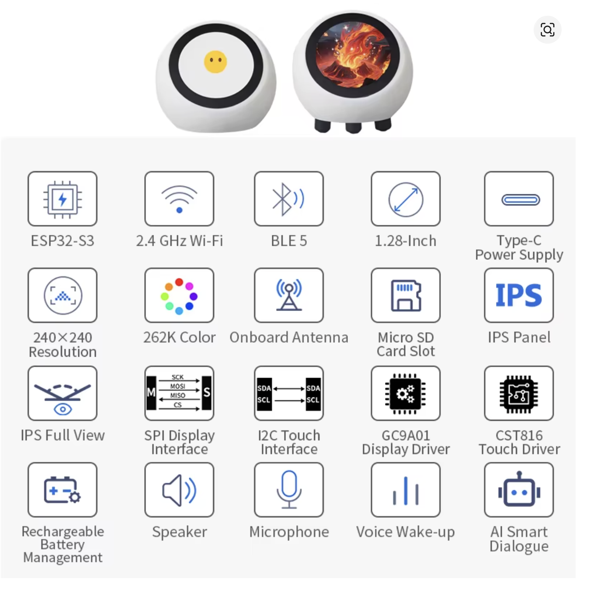
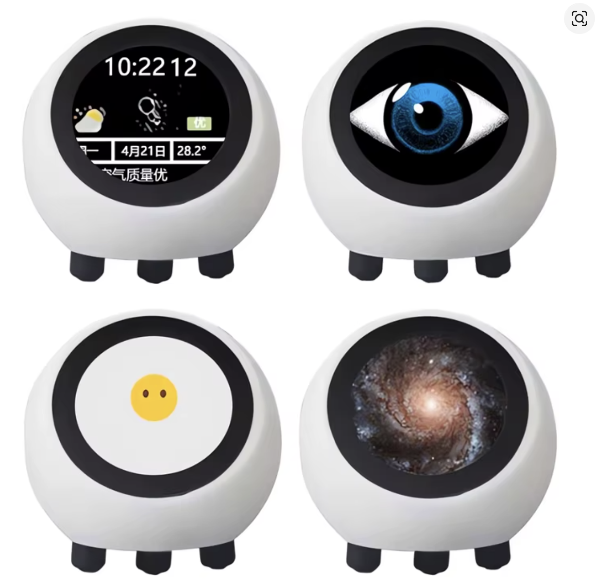
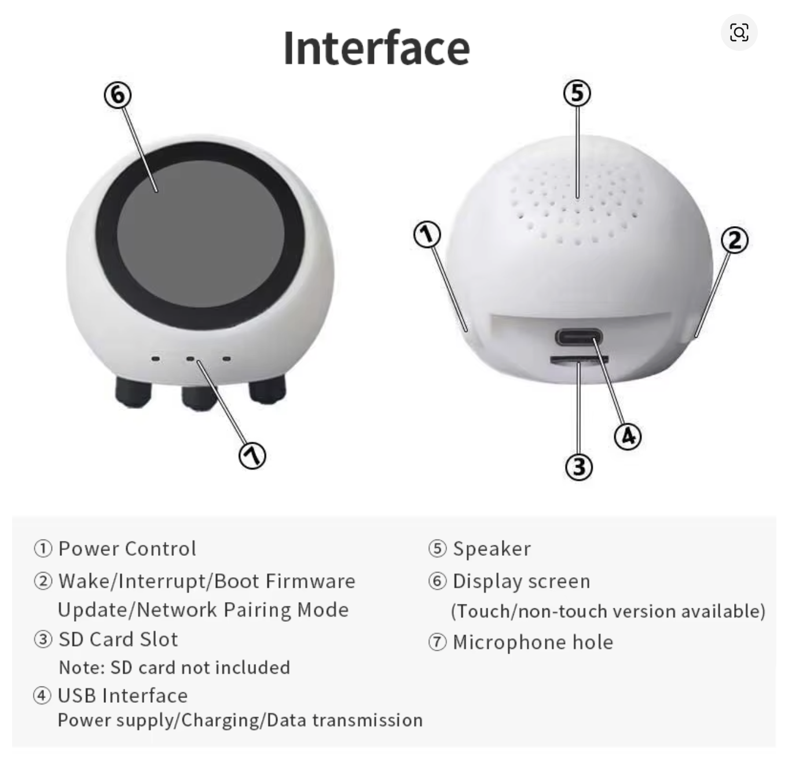

# my-xiaozhi-esp32

A fork of [xiaozhi-esp32](https://github.com/78/xiaozhi-esp32) customised for the **Spotpear ESP32-S3-1.28-BOX**, targeting a self-hosted local server instead of xiaozhi.me.

For the original xiaozhi-esp32 README see [README_original.md](README_original.md)

---

<p align="center">
  
</p>

## Hardware

- **Board**: Spotpear ESP32-S3-1.28-BOX — N16R8 (16 MB flash, 8 MB PSRAM)
- **Display**: GC9A01 1.28" round LCD
- **Touch**: CST816D
- **Audio codec**: ES8311
- **Micro SD slot**
- **Battery management**

---

## Architecture

The firmware connects to **Sibilla**, a self-hosted local server, for both OTA updates and WebSocket communication. There is no dependency on xiaozhi.me or any external cloud service.

The OTA URL can be configured in two ways:
- **Provisioning AP** — during WiFi setup, the "Advanced" tab in the captive portal exposes a "Custom OTA URL" field saved to NVS
- **Build-time hardcoding** — `scripts/build_firmware.py --mode hardcoded` compiles the URL directly into the firmware

---

## Images

### Features
<br>
<p align="center">
  
</p>
<br>

### Sample screens
<br>
<p align="center">
  
</p>
<br>

### Hardware interface
<br>
<p align="center">
  
</p>
<br>

---

## Repository structure

| Path | Description |
|------|-------------|
| `main/` | Firmware source (boards, application logic, assets) |
| `scripts/` | Build tools (`build_firmware.py`) |
| `webui/` | Local web UI for building and downloading firmware |
| `docs/` | Documentation and images |

---

## Getting started

**Prerequisites**: ESP-IDF 5.5.2 or later, Python 3.

```bash
# Activate ESP-IDF toolchain (every new terminal)
source ~/esp/esp-idf/export.sh

# Build with Sibilla server hardcoded
python3 scripts/build_firmware.py --mode hardcoded

# Or use the web UI (see webui/README.md)
python3 webui/server.py   # → http://localhost:5001
```

For full setup instructions see [SETUP.md](SETUP.md)

---

## Based on

[xiaozhi-esp32](https://github.com/78/xiaozhi-esp32) v2.2.4
